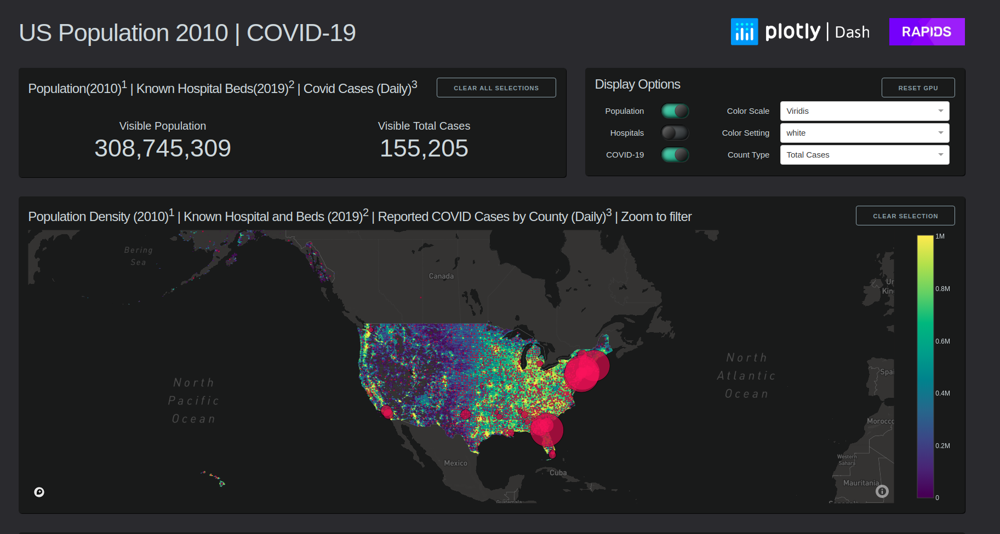
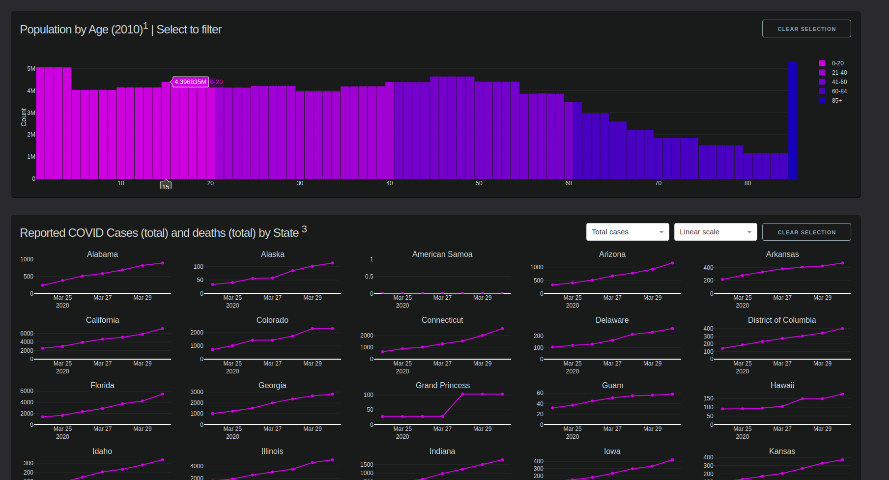

Plotly-RAPIDS Census 2010 Demo






# Steps to reproduce

## 1. Data prep

a. Download the dataset - https://drive.google.com/drive/folders/1AC8z95Co9Nm45yNii26mQBbNOzNkO19a?usp=sharing

## 2. Plotly demo

```bash
cd plotly_demo
mkdir data
cd data
#download data from source and save it at this location
cd ../

conda create -n test_environment

conda update -n test_environment --file environment.yml
 
```


#### Run

```bash
python app.py
```