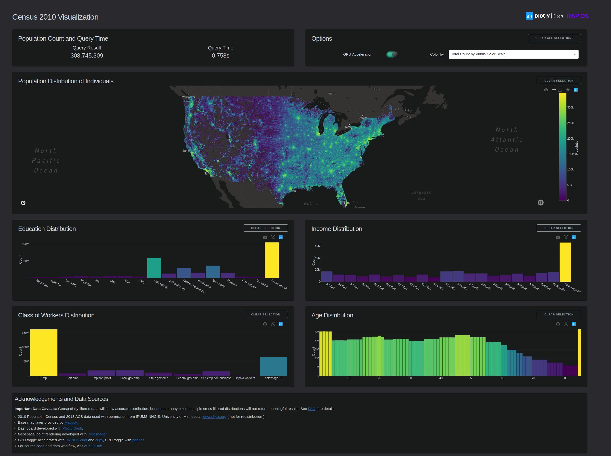

# Plotly-Dash + RAPIDS | Census 2010 Visualization



# Making of the Visualization
Find a detailed walk-through of how this visualization was made on our **[blog post](https://medium.com/rapids-ai/plotly-census-viz-dashboard-powered-by-rapids-1503b3506652)**.


# Installation and Run Steps

## Base Layer Setup
The visualization uses a Mapbox base layer that requires an access token. Create one for free [here on mapbox](https://www.mapbox.com/help/define-access-token/). Go to the demo root directory's `plotly_demo` folder and create a token file named `.mapbox_token`. Copy your token contents into the file.

**NOTE:** Installation may fail without the token.

## Running the Visualization App

You can setup and run the visualization with the conda or docker commands below. Once the app is started, it will look for the datasets locally and, if not found, will download them.

## Data 
There is 1 main dataset:

- 2010 Census for Population Density, combined with the 2010 ACS for demographics  (~2.9 GB) | downloaded on first run

For more information on how the Census and ACS data was prepared to show individual points, refer to the `/data_prep` folder.

### Conda Env

Verify the following arguments in the `environment.yml` match your system(easy way to check `nvidia-smi`):

cudatoolkit: Supported versions are `10.0, 10.1, 10.2`

```bash
# setup conda environment 
conda env create --name plotly_env --file environment.yml
source activate plotly_env

# run and access
cd plotly_demo
python app.py
```


### Docker

Verify the following arguments in the Dockerfile match your system:

1. CUDA_VERSION: Supported versions are `10.0, 10.1, 10.2`
2. LINUX_VERSION: Supported OS values are `ubuntu16.04, ubuntu18.04, centos7`

The most up to date OS and CUDA versions supported can be found here: [RAPIDS requirements](https://rapids.ai/start.html#req)

```bash
# build
docker build -t plotly_demo .

# run and access via: http://localhost:8050 / http://ip_address:8050 / http://0.0.0.0:8050
docker run --gpus all -d -p 8050:8050 plotly_demo
```

## Dependencies

- plotly=4.5
- cudf
- dash=1.8
- pandas=0.25.3
- cupy=7.1
- datashader=0.10
- dask-cuda=0.12.0
- dash-daq=0.3.2
- dash_html_components
- gunicorn=20.0
- requests=2.22.0+
- pyproj


## FAQ and Known Issues

**What hardware do I need to run this locally?** To run you need an NVIDIA GPU with at least 24GB of memory, at least 32GB of system memory, and a Linux OS as defined in the [RAPIDS requirements](https://rapids.ai/start.html#req).

**Important data caveaets** Geospatially filtered data will show correct distribution down to census block-group boundary levels. However, due to how the data is anonymized, tabulated, and a combination between census and ACS sources, cross filtering multiple distribution charts at once will not return meaningful results.

**How did you get individual point locations?** The population density points are randomly placed within a census block and associated to match distribution counts at a census block-group level. As such, they are not actual individuals, only a statistical representation of one, and some groupings may be artificial - especially if produced from multiple cross filters. 

**How are the population and distributions filtered?** Use the box select tool icon for the map or click and drag for the bar charts.

**Why is the population data from 2010?** Only census data is recorded on a block level, which provides the highest resolution population distributions available. For more details on census boundaries refer to the [TIGERweb app](https://tigerweb.geo.census.gov/tigerwebmain/TIGERweb_apps.html). 

**The dashboard stop responding or the chart data disappeared!** This is likely caused by an Out of Memory Error and the application must be restarted. 

**How do I request a feature or report a bug?** Create an [Issue](https://github.com/rapidsai/plotly-dash-rapids-census-demo/issues) and we will get to it asap. 


## Acknowledgments and Data Sources

- 2010 Population Census and 2018 ACS data used with permission from IPUMS NHGIS, University of Minnesota, [www.nhgis.org](https://www.nhgis.org/) ( not for redistribution )
- Base map layer provided by [Mapbox](https://www.mapbox.com/)
- Dashboard developed with [Plot.ly Dash](https://plotly.com/dash/)
- Geospatial point rendering developed with [Datashader](https://datashader.org/)
- GPU accelerated with [RAPIDS cudf](https://rapids.ai/) and [cupy](https://cupy.chainer.org/) | CPU with the [pandas](https://pandas.pydata.org/)
- For source code and data workflow, visit our [GitHub](https://github.com/rapidsai/plotly-dash-rapids-census-demo/tree/main)
